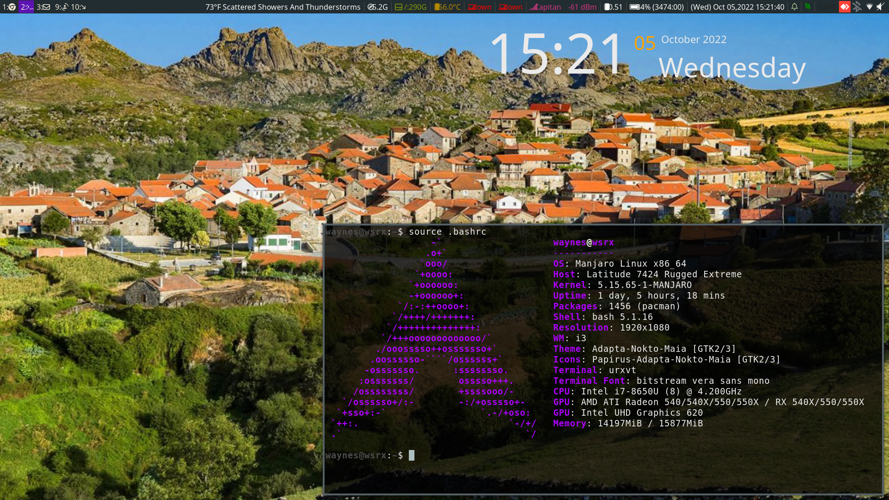

# i3laptop
This is very much the same as my i3Config except for a few changes due to this setup being using on my work laptop and requires certain programs to be run at login, the button startup in i3/config are tweaked to work with this specific laptop, etc. 

